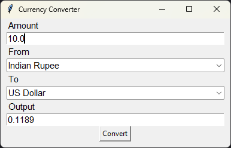

# 💱 Currency Converter

A sleek and user-friendly currency conversion tool built with Python and Tkinter.

## 🌟 Features

- Real-time currency exchange rates from [x-rates.com](https://www.x-rates.com/)
- Support for multiple currencies
- User-friendly graphical interface
- Configurable precision for conversion results
- Persistent window size and font settings
- Offline mode with cached exchange rates

## 🚀 Getting Started

### Prerequisites

- Python 3.6+
- pip (Python package manager)

## 🔧 Usage

1. Enter the amount you want to convert in the "Amount" field.
2. Select the currency you're converting from in the "From" dropdown.
3. Select the currency you're converting to in the "To" dropdown.
4. Click the "Convert" button to see the result.

## 🛠️ Configuration

- The application saves your window size and font preferences in `myapp.conf`.
- Exchange rates are cached in `data.txt` for offline use.

## 🤝 Contributing

Contributions are welcome! Here are some ways you can contribute to this project:

- Report bugs and issues
- Suggest new features or improvements
- Submit pull requests with bug fixes or new functionality

Happy converting! 💰✨
